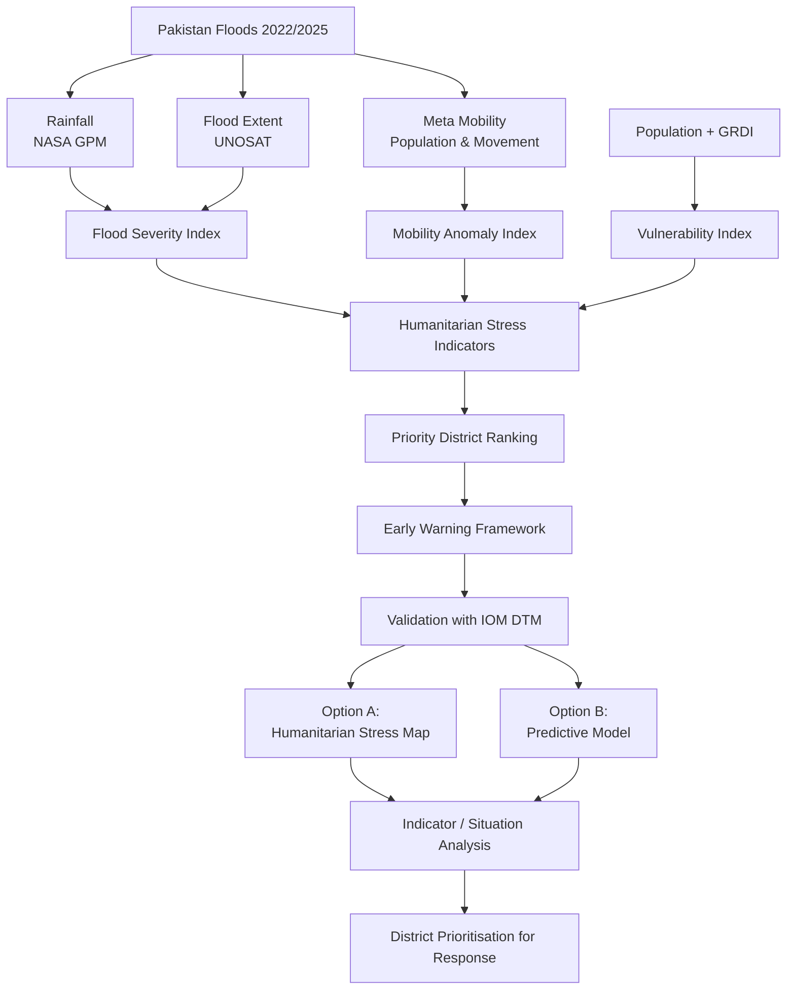

# FloodTraces Hackathon 2026

## Quick Links

📂 Dataset Repository (Zenodo)
https://zenodo.org/records/20728877

📖 Project Documentation
Coming Soon

🚨 Early Warning Framework
Coming Soon

📊 Analysis Results
Coming Soon

## Project

### Beyond Flood Maps: Detecting Humanitarian Stress Before Displacement Peaks 


Flood impacts often become visible in official displacement statistics only after humanitarian needs have already escalated. This project explores whether mobility anomalies, flood indicators, and vulnerability information can provide earlier signals of humanitarian stress and support anticipatory action.

---

## Research Question

Can digital trace data help identify districts at risk of severe displacement before official displacement statistics become available?

Can mobility anomalies act as an early warning indicator of humanitarian stress and displacement?

---

## Proposed Approaches

### Option A – Humanitarian Stress Index

Combine:

* Flood Severity
* Mobility Anomaly
* Vulnerability

Output:

* Priority District Ranking
* Humanitarian Stress Dashboard
* Early Warning Map

Workflow:

```text
Rainfall + Flood Extent
            +
      Meta Mobility
            +
 Population + GRDI
            ↓
 Humanitarian Stress Index
            ↓
  Priority Districts
```

---

### Option B – Mobility as an Early Warning Signal

Investigate whether unusual mobility patterns occur before displacement peaks.

Workflow:

```text
Flood Event
      ↓
Mobility Anomaly
      ↓
Displacement Peak
```

Questions:

* Do mobility anomalies appear before displacement?
* How many days earlier?
* Can mobility act as an early warning indicator?

---
### Option C - Combine both

---
## Possible Flowwork

## Available Data

| Dataset                       | Format         | Spatial Scale          |
| ----------------------------- | -------------- | ---------------------- |
| Meta Population During Crisis | CSV            | 800m Quadkeys / Admin2 |
| Meta Movement During Crisis   | CSV            | 800m Quadkeys / Admin2 |
| IOM DTM CNI                   | CSV/XLSX       | Village / District     |
| Flood Extent (UNOSAT)         | Shapefile      | Flood polygons         |
| Rainfall (NASA GPM)           | GeoTIFF Raster | 10 km                  |
| WFP Rainfall                  | CSV            | District               |
| WFP NDVI                      | CSV            | District               |
| WorldPop Population           | GeoTIFF Raster | 100 m                  |
| GRDI Deprivation              | GeoTIFF Raster | 1 km                   |
| GADM Boundaries               | Shapefile      | Admin Levels           |
| OCHA Boundaries               | Shapefile      | District / Tehsil      |

---

## Expected Deliverables ( Early Warning Framework )

### Mobility Anomaly Analysis
- Deliverable: District Priority Map
- Deliverable: 3D Animation vizulization

### Vulnerability Assessment
More concretely: Humanitarian Stress Index
-Deliverable: District Priority Map
- Deliverable: 3D Animation vizulization

  ## Sanity Checks
- Validation Against IOM DTM Data

  
- Final Hackathon Presentation

---

## Repository Structure

```text
data/
├── raw/
├── processed/

notebooks/

scripts/

outputs/
├── figures/
├── maps/
├── dashboard/

docs/
```

---

## Team Members

| Name | Role |
| ---- | ---- |
|  Munazza    |      |
|  Martina    |      |
|   Sebo |      |
|  Yaseen    |      |
|      |      |
